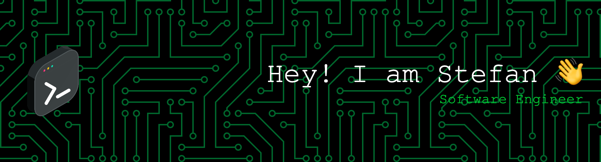

  

  
  
  

---

I'm a software engineer, mostly focused on (mobile) web frontend technologies.

### 📘 Latest Blog Posts

These are the latest posts on <a href="https://blog.stefankolb.de">my blog</a>:

<!-- BLOG-POST-LIST:START -->
- [Exclude node_modules folder from Time Machine backup](https://blog.stefankolb.de/posts/tips-and-tricks-4-exclude-node_modules-folder-from-time-machine-backup-short)
- [Create an RSS feed for your DEV.to Reading List](https://blog.stefankolb.de/posts/dev-3-rss-feed-for-dev-to-reading-list)
- [Fuzzy search for Astro using fzf and Preact](https://blog.stefankolb.de/posts/dev-2-fuzzy-search-for-astro-using-fzf-and-preact)
- [A fresh start](https://blog.stefankolb.de/posts/common-1-a-fresh-start)
- [Synchronize Atom.io&#39;s settings across devices](https://blog.stefankolb.de/posts/tips-and-tricks-22-synchronize-atomio-settings)
<!-- BLOG-POST-LIST:END -->

### 🛠️ Tech Stack

  <!-- Standards -->
  <!-- HTML -->
  
  <!-- CSS -->
  
  <!-- JavaScript -->
  

  <!-- Frameworks -->
  <!-- Node.js -->
  
  <!-- Sass -->
  
  <!-- React -->
  

  <!-- Tools -->
  <!-- Vite -->
  
  <!-- Git -->
  
  <!-- Gitea -->
  
  <!-- Github -->
  
  <!-- Visual Studio Code -->
  
  <!-- MDX -->
  
  <!-- Command Line -->
  

----

  
  

  
  
  

---

  From [stefankolb](https://github.com/stefankolb) @ :octocat:

  

